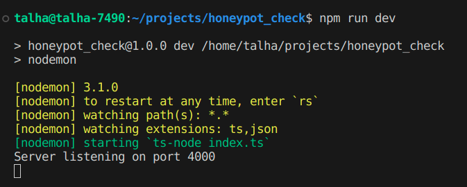
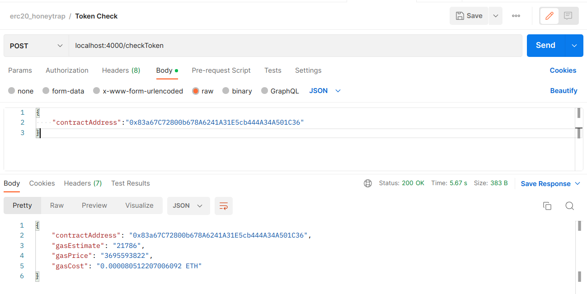
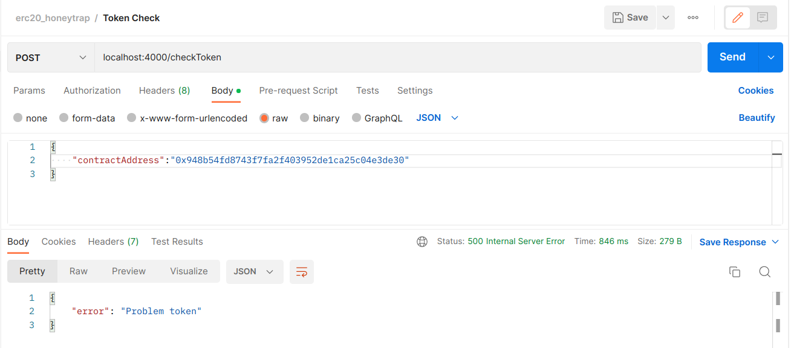

## HoneyPot Check - API for estimating gas cost

This project provides a simple API to estimate the gas cost for transferring tokens on the Ethereum mainnet.

### Installation

**Prerequisites:**

* Node.js and npm installed on your system (https://nodejs.org/en/learn/getting-started/how-to-install-nodejs)

**Steps:**

1. Clone the repository or download the project files.
2. Open a terminal and navigate to the project directory.
3. Install the project dependencies:

```bash
npm install
```

4. Run the project 

```bash
npm run dev
```


Once project is started make the request using postman. 
For a correct token the response would be gas estimate and price like below. If the price is too high from other examples u would deduce that token has high tax. 




For a token where the transfer is restricted we will get exception. 




